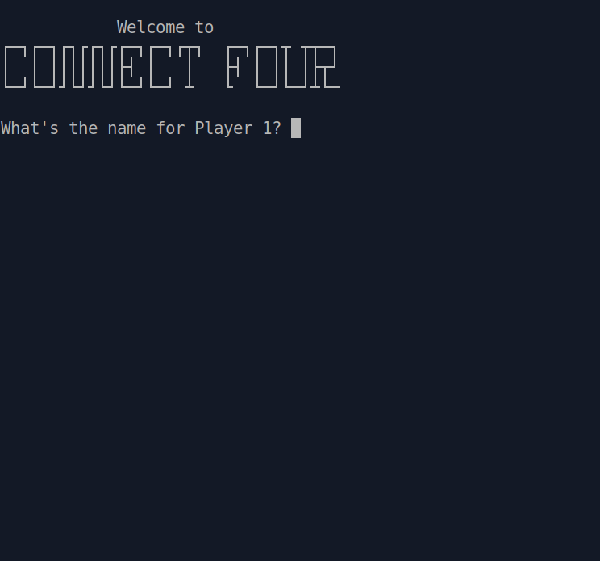
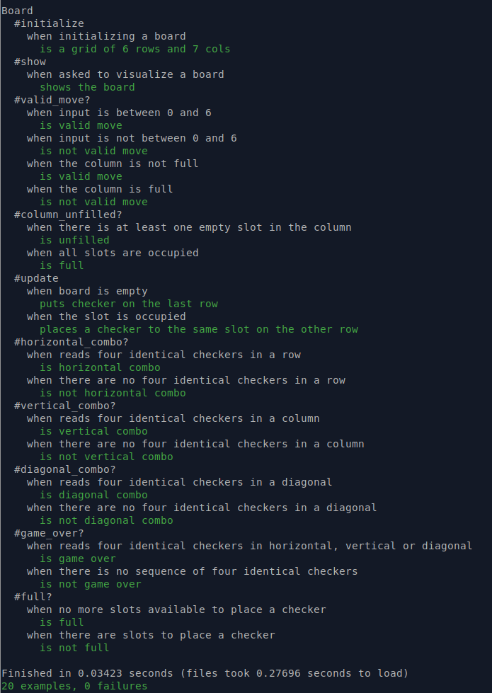
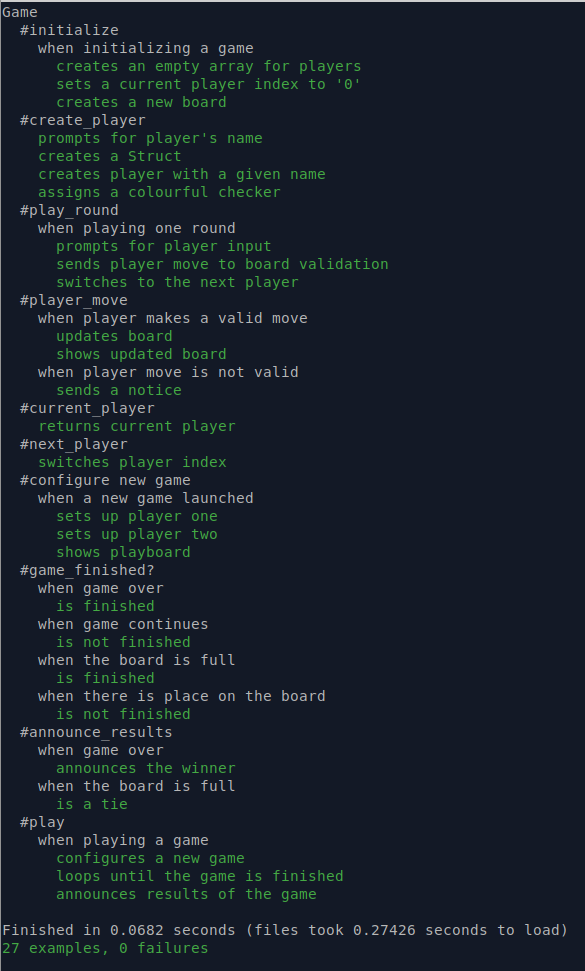

# Project: TDD Connect Four

### User interface

- CLI — Command Line Applications/Interface

### What's this

It's a simple Connect Four CLI game, but the point of the exercise was to make it using TDD approach called *red, green, refactor*, which involves writing a test that fails first, then writing code to make it pass, followed by refactoring.

Keep in mind that the tests suite I've created is obvious overkill for this kind of programm. It is, however, the way I think you would do it for a larger project, so I'm doing it this way on purpose.

Here is the structure of the tests suite for `Board` and `Game` classes. This is probably a good time to mention that I tried to make tests clean, organized, and understandable to anyone who will read them.

    
    

## Reflection

My first thought was: *"writing tests at all is hard enough... how am I supposed to write a test first? How the hell can I write a test for nothing?!"* Now, I think with a little practice, writing tests is actually fun. And I kinda enjoyed working on this project TDD-style. 

The *red-green* cycle requires you to really take time to think carefully about what exactly it is that we need to build, and how. From this point of view the assignment to write tests for previously built [Tic Tac Toe](https://github.com/Pandenok/tic_tac_toe) helped to refresh the ideas.

While working on project, I spent almost no time in debugger (just for UI refinement), because RSpec provides you with fast and detailed feedback, that helps you to identify the errors and problems quickly. So it was cool to not launch the programm until it passes all the tests written.

On code quality side, I noticed that it forces you to write short and small methods focused on one thing, so you don't write unnecessary code, and get stuck.

Lastly, it's just fun: like in computer game where you quickly kill all the monsters and then with calm collect all the coins, refill you armour, explore secret chambers, etc. When you write failing test you say *"hey, my app should do that!"*. Then make it come true as fast as you can, then relax and do refactoring.  

I must admit that it'd far more challenging to complete the project and I'd have never enjoyed all  benefits of TDD without the help of [@rlmoser99](https://github.com/rlmoser99) who was not only very kind in providing access to the testing playground, where I learnt and practiced basics of RSpec, but was very supportive and extremely helpful in guiding myself through all the doubts on testing. 

## Eventual Improvements List

- [ ] light up the winning combination on the board in case of `#game_over?`

- [ ] ABC size for `main_diagonals` and `anti_diagonals` is still too high. I used the code by fantastic Cary Swoveland found [here](https://stackoverflow.com/questions/53690155/connect-4-diagonal-win-check). Instead of using the additional `rotate` method for antidiagonals as he was suggesting, I worked with reversed board. I need to split `.concat` into the separate method.